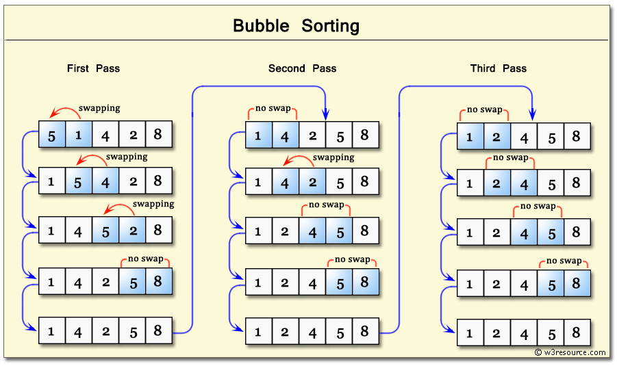

<!-- # Homework_Python -->
## Python_day_1(Основы)
Прошли основы, вспомнили переменные, условия, циклы, блоки Try-Except, и т.д.

```python
while True:
	try:
		# some code
		break

	except Error:
		pass
```
Некоторые исключения:
1. ValueError - операция или функция применяется к объекту несоответствующего типа.

2. TypeError - операция или функция получает аргумент неподходящего значения, например, исключение возникает, если попытаться преобразовать строку в число.

3. IndexError - обращение к элементу по несуществующему индексу.

4. ZeroDivisionError - деление числа на ноль.

5. FileNotFoundError - Python не может найти файл, который нужно открыть.

## Python_day_2(Списки)
Прошли списки, применение на них срезов , и методы работы с ними 

```python
list1 = []
list1.append(value) #добавить элемент в конец списка
list1.clear() #Очищает список
list1.extend(list2) #Расширяет список list, добавляя в конец все элементы списка list2
list1.insert(index, value) #Вставляет на место index элемент со значением value	
list1.join() #объединить два списка(только строковые значения)
list1.len() #узнать длину списку
list1.pop(index) #удалить элемент по индексу(без параметра, удаляет последний элемент)
list1.remove(value) #Удаляет первый элемент в списке, имеющий значение value.  # Если таких элементов нету, будет вызвана ошибка ValueError.
list1.reverse() #перевернуть список
```
## Python_day_3(Строки)
Прошли строки, узнали, что строки неизменяемый тип данных, узнали, что такое конкатенация, изучили методы работы с ними, под конец затронули тему множеств.

```python
str1 = "Python"
str1[0] #обратиться к элементу строки по индексу
str1.find('str',[start], [end]) #Поиск подстроки str в строке S в интервале индексов
# (start, end). Возвращает индекс первого совпавшего значения подстроки. Если
#  подстрока не найдена, возвращает −1.
#Здесь start и end — необязательные аргументы. Если они не заданы, поиск ведётся во всей строке
len(str1) #длина строки
str1.capitalize() #
```
## Python_day_4(Множества, словари)
Продолжили тему множеств, изучили работу со словарями, их методы, в ходе выполнения практических работ применили метод "Пузырьковой сортировки"

